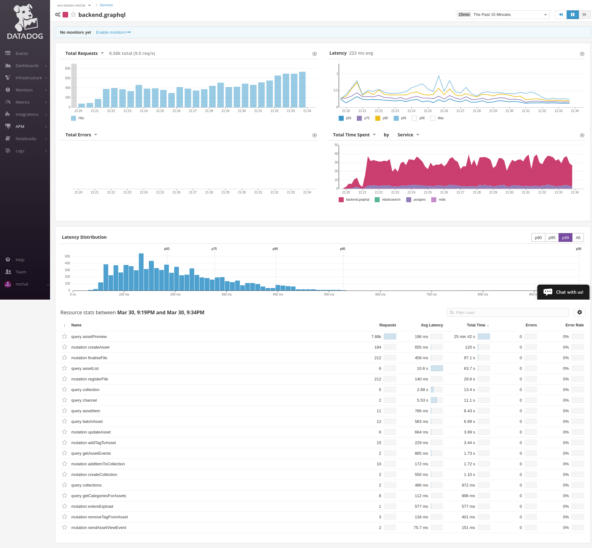
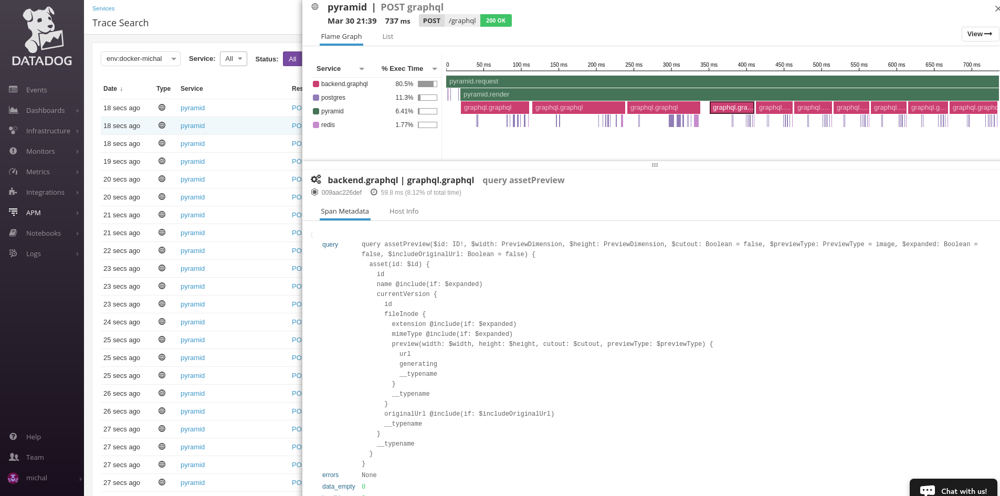

===============
ddtrace-graphql
===============

.. image:: https://travis-ci.org/beezz/ddtrace-graphql.svg?branch=master
   :target: https://travis-ci.org/beezz/ddtrace-graphql

.. image:: https://pyup.io/repos/github/beezz/ddtrace-graphql/shield.svg
   :target: https://pyup.io/repos/github/beezz/ddtrace-graphql/

Python library to trace graphql calls with Datadog.

* `graphql-core <https://github.com/graphql-python/graphql-core>`_

* `Datadog APM (Tracing) <https://docs.datadoghq.com/tracing/>`_

* `Datadog Trace Client <http://pypi.datadoghq.com/trace/docs/>`_

Compatibility
-------------

``ddtrace-graphql`` is tested with:

* Python versions: 3.5, 3.6, nightly
* graphql-core: 2.0, 1.1.0, latest
* ddtrace: 0.11.1, 0.10.1, latest

*Screenshots for pyramid app serving GraphQL with tracing enabled:*

   GraphQL service detail.

   GraphQL query detail.

Installation
============

Using pip
---------

.. code-block:: bash

   $ pip install ddtrace-graphql

From source
------------

.. code-block:: bash

   $ git clone https://github.com/beezz/ddtrace-graphql.git
   $ cd ddtrace-graphql && python setup.py install

Usage
=====

To trace all GraphQL requests patch the library. Put this snippet to your
application main entry point.

.. code-block:: python

   __import__('ddtrace_graphql').patch()

   # OR

   from ddtrace_graphql import patch
   patch()

Check out the `datadog trace client <http://pypi.datadoghq.com/trace/docs/>`_
for all supported libraries and frameworks.

.. note:: For the patching to work properly, ``patch`` needs to be called
          before any other imports of the ``graphql`` function.

.. code-block:: python

   # app/__init__.py
   __import__('ddtrace_graphql').patch()

   # from that point all calls to graphql are traced
   from graphql import graphql
   result = graphql(schema, query)

Trace only certain calls with ``traced_graphql`` function

.. code-block:: python

    from ddtrace_graphql import traced_graphql
    traced_graphql(schema, query)

Configuration
=============

Environment variables
=====================

:DDTRACE_GRAPHQL_SERVICE: Define service name under which traces are shown in Datadog. Default value is ``graphql``

.. code-block:: bash

   $ export DDTRACE_GRAPHQL_SERVICE=foobar.graphql

span_kwargs
===========

Default arguments passed to the tracing context manager can be updated using
``span_kwargs`` argument of ``ddtrace_graphql.patch`` or
``ddtrace_graphql.traced_graphql`` functions.

Default values:

:name: Wrapped resource name. Default ``graphql.graphql``.
:span_type: Span type. Default ``graphql``.
:service: Service name. Defaults to ``DDTRACE_GRAPHQL_SERVICE`` environment variable if present, else ``graphql``.
:resource: Processed resource. Defaults to query / mutation signature.

For more information visit `ddtrace.Tracer.trace <http://pypi.datadoghq.com/trace/docs/#ddtrace.Tracer.trace>`_ documentation.

.. code-block:: python

   from ddtrace_graphql import patch
   patch(span_kwargs=dict(service='foo.graphql'))

.. code-block:: python

   from ddtrace_graphql import traced_graphql
   traced_graphql(schema, query, span_kwargs=dict(resource='bar.resource'))

Development
===========

Install from source in development mode
---------------------------------------

.. code-block:: bash

   $ git clone https://github.com/beezz/ddtrace-graphql.git
   $ pip install --editable ddtrace-graphql[test]

Run tests
---------

.. code-block:: bash

   $ cd ddtrace-graphql
   $ tox
